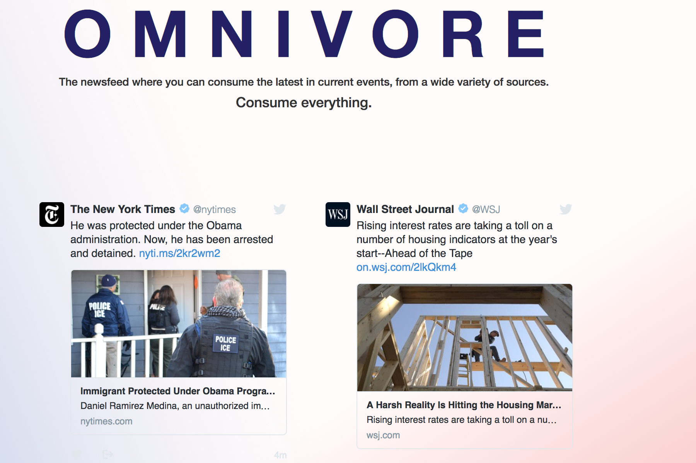

# twitter
OMNIVORE: 
Consume everything.

Non-partisan news from a variety of sources that allows consumers to get a full spectrum on world events with the most up-to-date news.

Objective: Design a simple news feed for users to quickly reference twitter feeds against varying points of views on topics.

Goal: Provide a simple news feed to quickly assess varying points of views on news across multiple media feeds.

Build/Code: Designed with JavaScript, HTML, and CSS.

